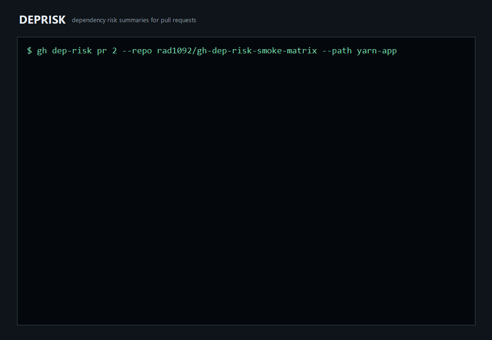

# gh-dep-risk

[](https://github.com/rad1092/gh-dependency-risk/actions/workflows/test.yml)
[](https://github.com/rad1092/gh-dependency-risk/actions/workflows/install-smoke.yml)

```text
██████╗ ███████╗██████╗ ██████╗ ██╗███████╗██╗  ██╗
██╔══██╗██╔════╝██╔══██╗██╔══██╗██║██╔════╝██║ ██╔╝
██║  ██║█████╗  ██████╔╝██████╔╝██║███████╗█████╔╝ 
██║  ██║██╔══╝  ██╔═══╝ ██╔══██╗██║╚════██║██╔═██╗ 
██████╔╝███████╗██║     ██║  ██║██║███████║██║  ██╗
╚═════╝ ╚══════╝╚═╝     ╚═╝  ╚═╝╚═╝╚══════╝╚═╝  ╚═╝
        dependency risk summaries for pull requests
```

`gh-dep-risk` is a precompiled GitHub CLI extension for on-demand pull request
dependency risk summaries.

It runs as `gh dep-risk`, reuses normal `gh` authentication, and does not run a
server, webhook receiver, GitHub App, database, queue, or dashboard.



The demo is generated from real CLI runs against owned live fixture pull
requests. The asciinema-compatible recording is checked in at
[docs/assets/demo.cast](docs/assets/demo.cast).

## Why Use It

- reviewer-facing summaries for dependency pull requests
- GitHub Dependency Review API first
- static local fallback only when Dependency Review is unavailable
- honest unsupported behavior instead of pretending to resolve full graphs
- optional PR timeline issue comment with one owned marker comment
- `--fail-level` for CI or manual workflow gates

Use GitHub's Dependency Review Action when you want repository policy
enforcement. Use vulnerability scanners such as OSV Scanner when you want a
vulnerability database scan. Use `gh-dep-risk` when a reviewer wants a quick,
auditable summary from a terminal or one-off workflow run.

## Install

Authenticate GitHub CLI first:

```bash
gh auth login
```

Install the extension:

```bash
gh extension install rad1092/gh-dep-risk
```

Upgrade later:

```bash
gh extension upgrade dep-risk
```

The install path intentionally uses `rad1092/gh-dep-risk` so GitHub CLI
registers the command as `gh dep-risk`. The readable repository slug is
`rad1092/gh-dependency-risk`.

## Quick Start

```bash
gh dep-risk pr 123
gh dep-risk pr https://github.com/OWNER/REPO/pull/123
gh dep-risk pr 123 --format json
gh dep-risk pr 123 --path apps/web
gh dep-risk pr 123 --comment
gh dep-risk pr 123 --fail-level high
gh dep-risk version --json
```

If the PR argument is omitted, `gh dep-risk pr` resolves the PR for the current
branch. Use `GH_REPO=OWNER/REPO` outside a git checkout.

`--fail-level` exits non-zero (code `3`) when the risk score meets the named
threshold: `medium` at 20, `high` at 40, `critical` at 70. `low` has a threshold
of 0, so it fails on any analyzed dependency change; use `none` (the default) to
never fail. See [docs/behavior.md](docs/behavior.md) for exit codes.

## Supported Analysis

Dependency Review API data is always preferred. Local fallback runs only when
Dependency Review is unavailable, for these static-file targets:

| Area | Local fallback |
| --- | --- |
| npm | `package.json`, `package-lock.json` |
| pnpm | `package.json`, `pnpm-lock.yaml`, `pnpm-workspace.yaml` discovery |
| Yarn Classic | `package.json`, classic `yarn.lock` |
| Yarn Berry / modern Yarn | direct `package.json` declarations matched to modern `yarn.lock` |
| Bun | direct `package.json` declarations matched to text `bun.lock` |
| Python | `requirements.txt`, PEP 621 `pyproject.toml`, Poetry, optional `uv.lock` / `poetry.lock` direct enrichment |
| Go modules | static `go.mod` `require` / `replace` changes, with `go.sum` checksum evidence only |

No local resolver, full transitive graph reconstruction, registry metadata
expansion, `.pnp.cjs` parsing, or binary `bun.lockb` parsing is attempted. See
[docs/support-matrix.md](docs/support-matrix.md) for the full scope and
unsupported behavior, and [docs/behavior.md](docs/behavior.md) for target
selection, scoring, bundles, and exit codes.

## Output

Formats:

- `human`: concise reviewer summary
- `json`: stable machine-readable report
- `markdown`: PR-comment-ready output starting with `<!-- gh-dep-risk -->`

Bundle output:

```bash
gh dep-risk pr 123 --bundle-dir ./dep-risk-bundle
```

This writes `dep-risk-human.txt`, `dep-risk.json`, `dep-risk.md`,
`metadata.json`, and per-target files under `targets/` when multiple targets
are analyzed.

## Config

`gh dep-risk pr` reads `.gh-dep-risk.yml` from the current directory when it
exists.

```yaml
lang: en
fail_level: high
comment: true
path:
  - apps/web
  - package.json
no_registry: false
```

CLI flags override config values. Unknown config keys are rejected.

## Comment Mode

`--comment` uses PR timeline issue comments, never review comments.

- marker comment: `<!-- gh-dep-risk -->`
- exactly one marker comment owned by the authenticated user is maintained
- older duplicate marker comments owned by the same user are deleted
- marker comments from other authors are never edited or deleted

## Validation

Release validation uses real pull requests in owned smoke repositories, not
only fixtures. The current matrix covers npm, pnpm, Yarn Classic, Python
requirements, PEP 621, Poetry, uv, Go modules, Yarn Berry, Bun text
`bun.lock`, and unsupported `bun.lockb` behavior.

See [docs/smoke-test.md](docs/smoke-test.md) for the exact commands.

## Development

```bash
go test ./...
go build -o gh-dep-risk .
./gh-dep-risk version --json
```

Windows PowerShell:

```powershell
go build -o gh-dep-risk.exe .
.\gh-dep-risk.exe version --json
```

See [CONTRIBUTING.md](CONTRIBUTING.md) for local development and
[RELEASING.md](RELEASING.md) for release steps.


## License

This project is licensed under the [MIT License](LICENSE).
